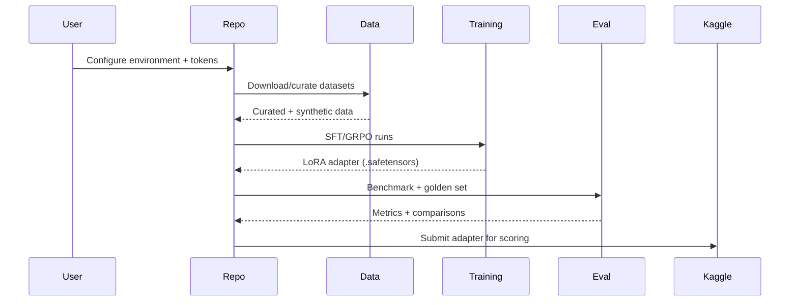
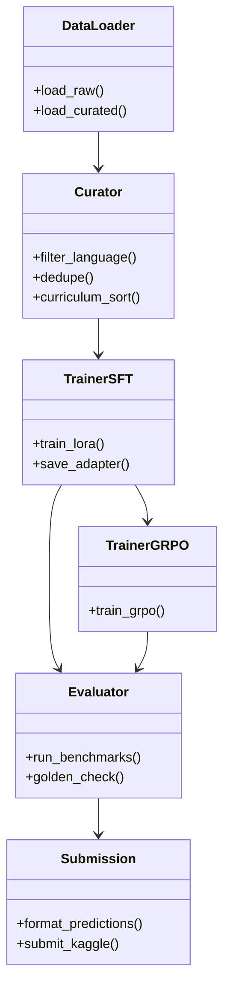

# CS4650 NVIDIA Nemotron Model Reasoning Challenge

Capstone project repo for Kaggle's **NVIDIA Nemotron Model Reasoning Challenge**. This repository currently contains **planning and architecture docs only**; implementation (code, notebooks, pipelines) is pending.

## Quick Links (Canonical Docs)
- **Execution plan (source of truth):** `docs/planning/plan_v0.2.md`
- **Plan review / rationale:** `docs/planning/plan_review.md`
- **Docs index:** `docs/README.md`
- **Competition facts / constraints:** `docs/architecture/COMPETITION.md`
- **System design:** `docs/architecture/ARCHITECTURE.md`
- **Notebook registry:** `docs/execution/NOTEBOOKS.md`
- **Sprint plan + issue mapping:** `docs/execution/SPRINTS.md`
- **Adversarial review (gaps):** `docs/analysis/ADVERSARIAL_REVIEW.md`

---

## Architecture (UML)

### System Context (High-Level)
```mermaid
flowchart LR
  Kaggle[Kaggle Competition]
  Data[(Datasets)]
  BaseModel[Base Model
NVIDIA Nemotron-3-Nano-4B]
  Repo[This Repo
(Planning + Code)]
  Training[Training Pipeline
SFT/GRPO]
  Eval[Evaluation + Benchmarks]
  Adapter[LoRA Adapter
.safetensors]
  Submission[Submission Notebook]

  Kaggle --> Data
  Data --> Repo
  BaseModel --> Repo
  Repo --> Training --> Adapter --> Submission --> Kaggle
  Repo --> Eval --> Kaggle
```
### Pipeline (Sequence)

### Module View (Planned)

---

## Reference Map (Features / Pipeline / Planning / Sprint)

- **Features & pipeline phases:** `docs/planning/plan_v0.2.md`
- **Architecture & design rationale:** `docs/architecture/ARCHITECTURE.md`
- **Competition constraints:** `docs/architecture/COMPETITION.md`
- **Sprint breakdown + issue mapping:** `docs/execution/SPRINTS.md`
- **Notebook registry (planned + actual):** `docs/execution/NOTEBOOKS.md`
- **Risk review / gaps:** `docs/analysis/ADVERSARIAL_REVIEW.md`

---

## Feature Status (Current)

### Finished
- Planning docs and execution plan drafted (`docs/planning/plan_v0.2.md`)
- Architecture & competition constraint documentation (`docs/architecture/*`)
- Sprint mapping and execution docs (`docs/execution/*`)
- Adversarial review + risk analysis (`docs/analysis/*`)

### Remaining (Implementation)
- Phase 0: Repo setup + environment scaffolding (requirements, env, gitignore)
- Phase 1: Baseline inference + smoke test + dummy Kaggle submission
- Phase 2: Prompting strategy experiments + comparison
- Phase 3: Data curation + validation/golden sets
- Phase 4: SFT LoRA training and adapter output
- Phase 5: Synthetic data generation
- Phase 6: GRPO RL training (optional)
- Phase 7: Evaluation + approach comparison
- Phase 8: Final submission + capstone reporting

---

## Contributing / Working Conventions
- Put reusable code in `src/`. Keep notebooks thin.
- Register every notebook in `docs/execution/NOTEBOOKS.md`.
- Keep large artifacts out of git (`data/`, `adapters/`, `experiments/`).
- Use environment variables; never hardcode secrets.

---

## Getting Started
1. Read `docs/README.md` for the routing index.
2. Use `docs/planning/plan_v0.2.md` for the full execution plan.
3. Check `docs/execution/SPRINTS.md` to align tasks with current sprint.
