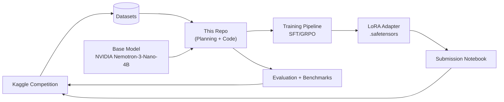
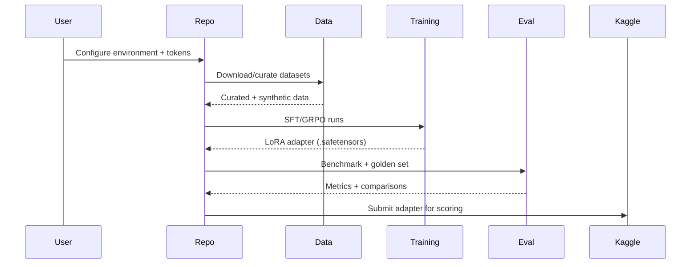
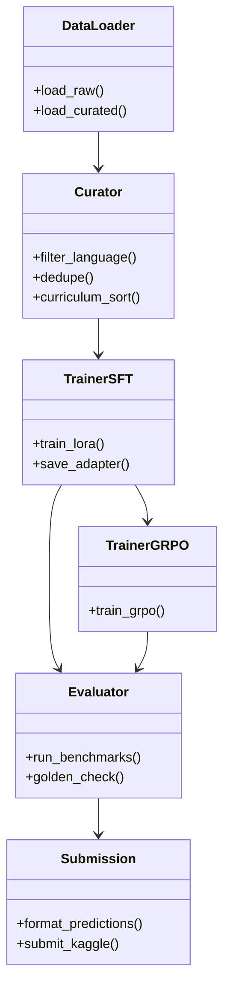

# CS4650 NVIDIA Nemotron Model Reasoning Challenge

Capstone project repo for Kaggle's **NVIDIA Nemotron Model Reasoning Challenge**. The repository has an active implementation: `src/` library, 248-test suite, 11 notebooks, synthetic data pipeline, SFT masking utility, and HPC training scripts. Submission deadline: 2026-06-15.

## Quick Links (Canonical Docs)
- **Execution plan (source of truth):** `docs/planning/plan_v0.2.md`
- **Plan review / rationale:** `docs/planning/plan_review.md`
- **Docs index:** `docs/README.md`
- **Competition facts / constraints:** `docs/architecture/COMPETITION.md`
- **System design:** `docs/architecture/ARCHITECTURE.md`
- **Notebook registry:** `docs/execution/NOTEBOOKS.md`
- **Sprint plan + issue mapping:** `docs/execution/SPRINTS.md`
- **Adversarial review (gaps):** `docs/analysis/ADVERSARIAL_REVIEW.md`

---

## Architecture (UML)

### System Context (High-Level)

### Pipeline (Sequence)

### Module View (Planned)

---

## Reference Map (Features / Pipeline / Planning / Sprint)

- **Features & pipeline phases:** `docs/planning/plan_v0.2.md`
- **Architecture & design rationale:** `docs/architecture/ARCHITECTURE.md`
- **Competition constraints:** `docs/architecture/COMPETITION.md`
- **Sprint breakdown + issue mapping:** `docs/execution/SPRINTS.md`
- **Notebook registry (planned + actual):** `docs/execution/NOTEBOOKS.md`
- **Risk review / gaps:** `docs/analysis/ADVERSARIAL_REVIEW.md`

---

## Feature Status (Current)

### Implemented
- Planning, architecture, and competition constraint docs (`docs/`)
- Canonical schema + contracts (`src/contracts.py` — `ReasoningExample`, `SFTExample`, `EvalRecord`)
- Dataset ingestion + EDA (notebooks 00–02)
- Validation split + golden regression set code (`src/evaluation/`)
- Golden gate + submission packaging (`src/evaluation/golden_gate.py`, `src/inference/submission.py`)
- Bit-manipulation solver + `CategoryRouter` solver framework (`src/solvers/`, `src/inference/solver.py`)
- Synthetic data pipeline: quality filters, cost caps, dry-run, fingerprinting (`src/data/synthetic.py`)
- Prompt templates wired per category (`configs/synthetic_prompts.yaml`)
- Notebook 08 fully executable (smoke generation, stub teacher, provenance)
- SFT loss masking (`src/training/sft_trainer.py` — `apply_loss_mask()`)
- Training configs: LoRA baseline r=32, QLoRA r=16, 100-step smoke (`configs/lora_*.yaml`, `configs/smoke_sft.yaml`)
- Full HPC runbook scripts (`scripts/hpc/` — preflight, tokenize, sbatch×2, checkpoint, gate, package, resume)
- 248 passing tests

### Pending (requires HPC / real data)
- Real validation + golden artifacts (need Kaggle dataset access)
- Real baseline eval run under `data/eval/runs/`
- Prompt + decode sweeps (notebook 05, blocked on real splits)
- Trajectory / failure slice collection (notebook 06)
- Notebook 07 (teacher/solver framework walkthrough)
- Actual SFT smoke training run on cluster
- Checkpoint promotion through golden gate
- Final adapter package + Kaggle submission

---

## Contributing / Working Conventions
- Put reusable code in `src/`. Keep notebooks thin.
- Register every notebook in `docs/execution/NOTEBOOKS.md`.
- Keep large artifacts out of git (`data/`, `adapters/`, `experiments/`).
- Use environment variables; never hardcode secrets.

---

## Getting Started
1. Read `docs/README.md` for the routing index.
2. Use `docs/planning/plan_v0.2.md` for the full execution plan.
3. Check `docs/execution/SPRINTS.md` to align tasks with current sprint.