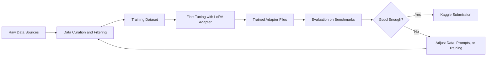
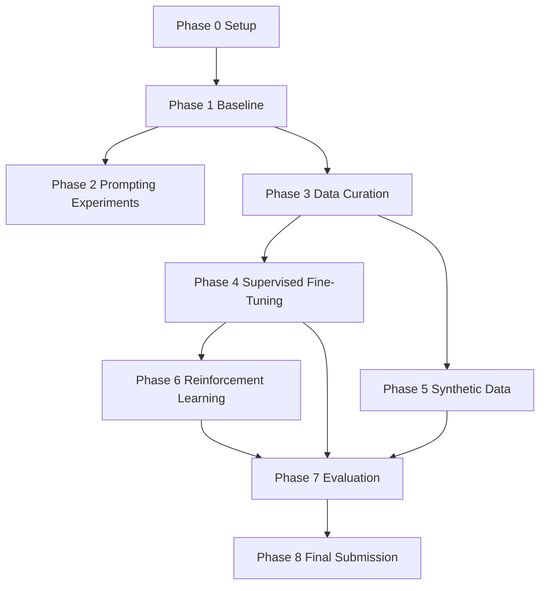
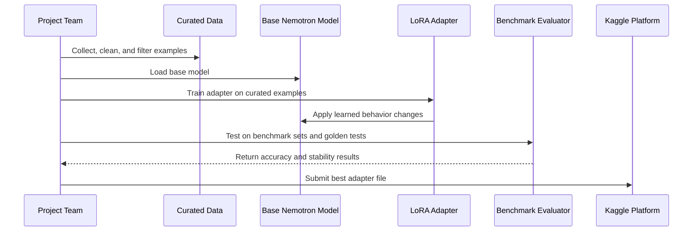

# Nemotron Challenge Concepts For Non-Technical Readers

Last Updated: 2026-04-20

## Why This Guide Exists

This project plan includes many AI, data, and engineering terms that can feel dense if you do not work in machine learning every day.

This guide explains those concepts in plain language so teammates, reviewers, and stakeholders can understand:

- what the team is building,
- why each phase matters,
- what success looks like,
- and where risks can happen.

## One-Minute Summary

The team is trying to improve how well an AI model solves reasoning problems (especially math and logic), then submit those improvements to a Kaggle competition.

Instead of changing the full model, the team trains a small "add-on" (called an adapter) that teaches the model better reasoning behavior. The project follows a staged plan: set up tools, measure a baseline, prepare cleaner training data, train the adapter, evaluate quality, and submit.

## Big Picture Architecture

## End-To-End Workflow (Phases 0 to 8)

## Concept Glossary (Plain Language)

### Competition And Goal Concepts

- Kaggle competition: An online challenge where teams submit model improvements and are ranked by score.
- Reasoning accuracy: How often the model gets difficult reasoning questions correct.
- Baseline score: The model's starting performance before any improvements.
- Leaderboard: Public ranking table of all submitted results.

### Model Concepts

- Base model: The original AI model provided by NVIDIA.
- Nemotron-3-Nano-4B: The specific model used in this project.
- Parameters: Internal numeric settings of a model; more parameters usually mean a larger model.
- Context window: The amount of text the model can read at once.
- Inference: Running the model to generate an answer.
- Reasoning on/off: Whether the model is prompted to show internal step-by-step thinking output format.

### Adapter And Training Concepts

- LoRA adapter: A compact add-on file that modifies model behavior without retraining the full model.
- Fine-tuning: Teaching an existing model new behavior using additional examples.
- Supervised fine-tuning (SFT): Training with question-and-answer examples where the desired answer is known.
- QLoRA: A memory-efficient version of LoRA training that works on smaller GPUs.
- GRPO: A reinforcement-learning method that rewards better outputs and discourages worse outputs.
- Reward function: A scoring rule used during reinforcement learning to guide model behavior.
- Checkpoint: A saved snapshot of model progress during training.
- Regression: A bad change where a model becomes worse on tasks it previously handled correctly.

### Data Concepts

- Dataset: A structured collection of examples used for training or evaluation.
- Data curation: Cleaning and filtering data so only useful examples are kept.
- Synthetic data: New examples generated by another model instead of written by humans.
- Deduplication: Removing repeated or near-duplicate examples.
- Curriculum learning: Training from easier examples to harder examples.
- Validation set: A held-out sample used to measure progress during training.
- Golden set: A small must-pass test set used to catch regressions quickly.

### Prompting Concepts

- Prompt engineering: Carefully designing instructions to improve output quality.
- Zero-shot prompting: Asking a question directly, with no worked example.
- Few-shot prompting: Including a few solved examples before asking a new question.
- Chain-of-thought style prompting: Asking the model to reason in steps.
- Self-consistency: Sampling many answers and choosing the most common final answer.
- Best-of-N: Generate multiple candidate answers and keep the best one.

### Evaluation Concepts

- Benchmark: A standard test set used to compare models fairly.
- MATH500, AIME25, GPQA, GSM8K: Different benchmark suites for reasoning performance.
- Mean and standard deviation: Average score and how much results vary across repeated runs.
- Statistical significance: Confidence that an observed improvement is real, not random noise.
- pass@k: Probability that at least one correct answer appears in k attempts.

### Reliability And Reproducibility Concepts

- Seed: A starting value for random number generation, used to make runs repeatable.
- Reproducibility: Ability to rerun and get comparable results.
- Early stopping: Ending training when quality stops improving.
- OOM (out of memory): GPU memory is exhausted during training.
- OOM recovery ladder: A step-by-step fallback plan for reducing memory usage.

### Infrastructure And Operations Concepts

- GPU: Hardware specialized for AI workloads.
- HPC cluster: Shared high-performance computing environment for long training jobs.
- Colab Pro: Cloud notebook environment with access to stronger GPUs.
- WandB (Weights and Biases): Tool for tracking experiments, metrics, and training curves.
- Storage planning: Making sure enough disk space exists for datasets and checkpoints.

### Submission Concepts

- Adapter weights (.safetensors): The file format used to save and submit trained adapter parameters.
- Submission pipeline: The end-to-end process that packages the adapter for Kaggle.
- Smoke test: A small quick test to confirm the pipeline works before bigger runs.

## How The Model Is Improved (Simple View)

## Why The Plan Uses Multiple Approaches

The plan tests several improvement paths because each one helps in a different way:

- Prompting: Fast and cheap, no model retraining needed.
- Data curation: Often the highest quality lever for better learning.
- SFT with LoRA: Core method for measurable model improvement.
- Synthetic data: Expands training material when high-quality labeled data is limited.
- GRPO reinforcement learning: Can improve reasoning quality further when compute budget allows.

## Risk Controls Explained In Plain Language

- Phase gates: Each phase has "done" criteria so the team does not move forward on weak results.
- Validation and golden sets: Prevent overfitting and detect regressions early.
- Checkpointing: Protects progress from interruptions.
- Scope cutting priorities: If time is short, lower-priority work is dropped first to protect minimum viable submission.
- Cost caps: Prevent overspending on API-based synthetic data generation.

## Hardware Strategy In Simple Terms

- Small local GPUs are used for setup, exploration, and lightweight experiments.
- Cloud GPUs are used for medium training/evaluation.
- HPC resources are reserved for heavy training jobs like full SFT and GRPO.

This staged approach controls cost while still enabling high-quality training when needed.

## What Success Looks Like For Non-Technical Stakeholders

- A valid adapter is submitted and accepted by Kaggle.
- Scores improve over the baseline on key reasoning benchmarks.
- Previously solved "golden" problems remain solved (no regressions).
- Results are reproducible and documented.
- Tradeoffs (cost, time, quality) are clearly recorded.

## Quick FAQ

### Why not retrain the whole model?

Retraining a full 4B model is much more expensive. LoRA adapters are smaller, cheaper, and faster to iterate.

### Why run the same benchmark multiple times?

Model outputs can vary run to run. Repeating runs helps separate real improvements from random fluctuations.

### Why are there both validation and golden sets?

Validation tracks overall progress. Golden set protects against breaking known-good behavior.

### Why include both prompting and training methods?

Prompting is fast and low cost; training changes deeper model behavior. Combining both gives better chances of strong final performance.

## Suggested Companion Reading

- docs/planning/plan_v0.2.md for full execution details
- docs/planning/plan_review.md for why plan changes were made
- docs/architecture/ARCHITECTURE.md for technical system design
- docs/architecture/COMPETITION.md for competition constraints
